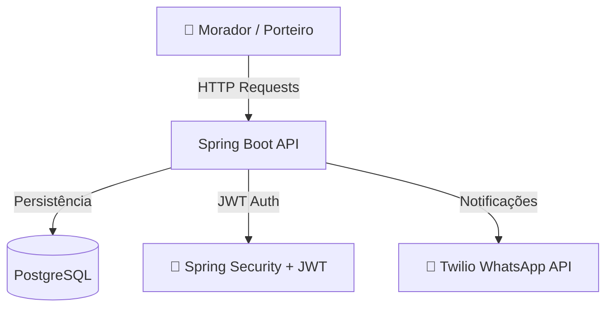

# 📦 Locker System

Um sistema de **gerenciamento de armários de encomendas** para portarias de prédios.  
Este repositório contém o **backend** desenvolvido em **Java Spring Boot**, como estudo prático de:

- Autenticação e autorização com **JWT**
- Persistência de dados com **PostgreSQL**
- **Validação de token de entrega**
- Integração com **Twilio Sandbox (WhatsApp)**
- Exposição de uma **API REST** para integração com front-end

---

## 📚 Sumário

- [Tecnologias Utilizadas](#-tecnologias-utilizadas)  
- [Requisitos](#-requisitos)  
- [Instalação](#-instalação)  
- [Configuração](#-configuração)  
- [Estrutura do Projeto](#-estrutura-do-projeto)  
- [Autenticação JWT](#-autenticação-jwt)  
- [Integração com Twilio](#-integração-com-twilio)  
- [Endpoints Principais](#-endpoints-principais)  
- [Arquitetura](#-arquitetura)  
- [Roadmap](#-roadmap)  
- [Licença](#-licença)  

---

## 🚀 Tecnologias Utilizadas

- **Java 17+**
- **Spring Boot** (Web, Data JPA, Security)
- **PostgreSQL**
- **Hibernate**
- **JWT** (JSON Web Token)
- **Twilio API** (Sandbox WhatsApp)
- **Maven**

---

## 🖥️ Requisitos

Antes de começar, instale:

- [Java 17+](https://adoptium.net/)  
- [Maven](https://maven.apache.org/)  
- [PostgreSQL](https://www.postgresql.org/)  

---

## ⚙️ Instalação

1. Clone o repositório:

```bash
git clone https://github.com/mariavitoriaventura/LockerSystem.git
cd LockerSystem
```

2. Configure o banco de dados PostgreSQL:

```sql
CREATE DATABASE locker_system;
```

3. Configure o arquivo `src/main/resources/application.properties` com suas credenciais:

```properties
spring.datasource.url=jdbc:postgresql://localhost:5432/locker_system
spring.datasource.username=seu_usuario
spring.datasource.password=sua_senha

spring.jpa.hibernate.ddl-auto=update
spring.jpa.show-sql=true
```

4. Configure o Twilio para envio de mensagens:

```properties
twilio.account_sid=SEU_ACCOUNT_SID
twilio.auth_token=SEU_AUTH_TOKEN
twilio.phone_number=SEU_NUMERO_TWILIO
```

5. Execute a aplicação:

```bash
mvn spring-boot:run
```

A API estará disponível em:  
👉 `http://localhost:8080`

---

## 📂 Estrutura do Projeto

```
LockerSystem/
 ├── src/main/java/com/lockersystem
 │    ├── controller   # Controllers REST
 │    ├── model        # Entidades JPA
 │    ├── repository   # Interfaces de acesso ao banco
 │    ├── service      # Regras de negócio
 │    └── security     # Configurações de autenticação e JWT
 └── src/main/resources
      ├── application.properties
      └── ...
```

---

## 🔑 Autenticação JWT

1. O usuário realiza login e recebe um **token JWT**.  
2. Esse token deve ser enviado em todas as requisições protegidas no header:

```
Authorization: Bearer <seu_token_jwt>
```

3. O token expira após determinado tempo, sendo necessário gerar outro via login.

---

## 💬 Integração com Twilio

O sistema envia mensagens via **WhatsApp** para notificar os moradores quando a encomenda é registrada.  

Exemplo de mensagem enviada:  
> 📦 Sua encomenda chegou!  
> Locker: #12  
> Token de retirada: `ABC123`

⚠️ Durante o desenvolvimento é necessário usar o **Sandbox do Twilio** e registrar seu número no grupo de testes.

---

## 📡 Endpoints Principais

### Autenticação
```
POST /auth/login
```
- Entrada: `{ "username": "user", "password": "123" }`
- Saída: `{ "token": "jwt_token_aqui" }`

---

### Moradores
```
GET /residents
POST /residents
PUT /residents/{id}
DELETE /residents/{id}
```

### Entregas
```
GET /deliveries
POST /deliveries
PUT /deliveries/{id}
DELETE /deliveries/{id}
```

### Lockers
```
GET /lockers
POST /lockers
PUT /lockers/{id}
```

---

## 🏗️ Arquitetura



---

## 🔮 Roadmap

- [x] Autenticação com JWT  
- [x] Registro e consulta de moradores  
- [x] Registro de entregas vinculadas a apartamentos  
- [x] Integração com Twilio Sandbox (WhatsApp)  
- [ ] Confirmação de coleta com foto  
- [ ] Papéis de usuário (porteiro, administrador, morador)  
- [ ] Logs de auditoria de ações  
- [ ] Deploy em nuvem (Heroku / AWS)  

---

## 📜 Licença

Este projeto foi desenvolvido com finalidade **educacional e de estudo** em **Java Spring Boot**.  
Sinta-se à vontade para clonar e adaptar para seus próprios projetos.  

---
